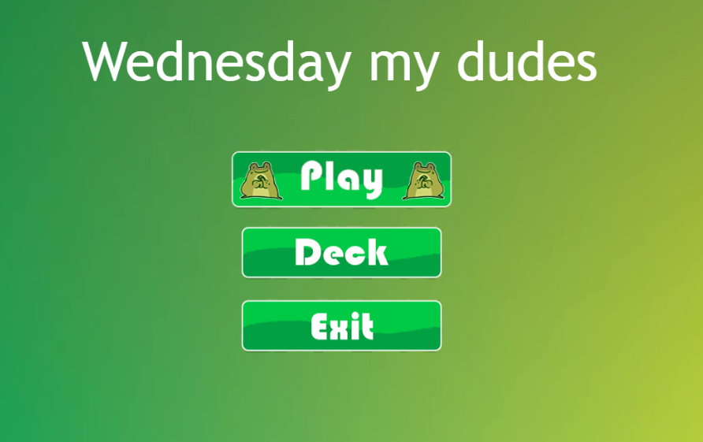
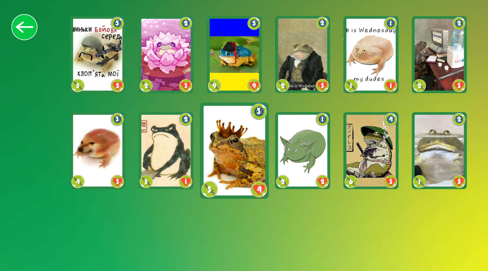
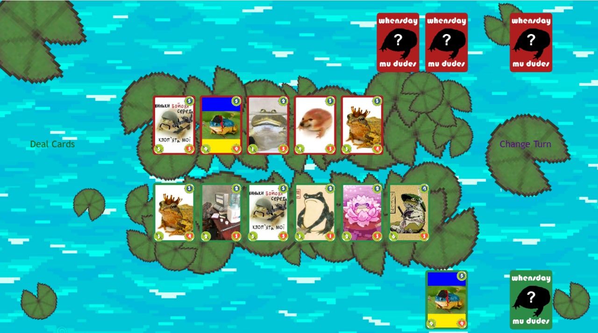

# Wednesday my dudes

## Game screenshots
### Game menu

### Game deck

### Game

## How to start

| Command            | Description                  |
|--------------------|------------------------------|
| `npm install`      | Install npm packages server. |
| `npm start`        | Start server.                |
| `cd client`        | Change directory to client.  |
| `cd install`       | Install npm packages client. |
| `npm run start`    | Start first client.          |
| `open new console` | Open new console window.     |
| `cd client`        | Change directory to client.  |
| `npm run start`    | Start second client.         |

## Requirements

[Node.js](https://nodejs.org) is required to install dependencies and run scripts via `npm`.

## Available Commands

| Command | Description |
|---------|-------------|
| `npm install` | Install project dependencies |
| `npm start` | Build project and open web server running project |
| `npm run build` | Builds code bundle with production settings (minification, uglification, etc..) |

## Writing Code

After cloning the repo, run `npm install` from your project directory. Then, you can start the local development
server by running `npm start`.

After starting the development server with `npm start`, you can edit any files in the `src` folder
and webpack will automatically recompile and reload your server (available at `http://localhost:8080`
by default).

